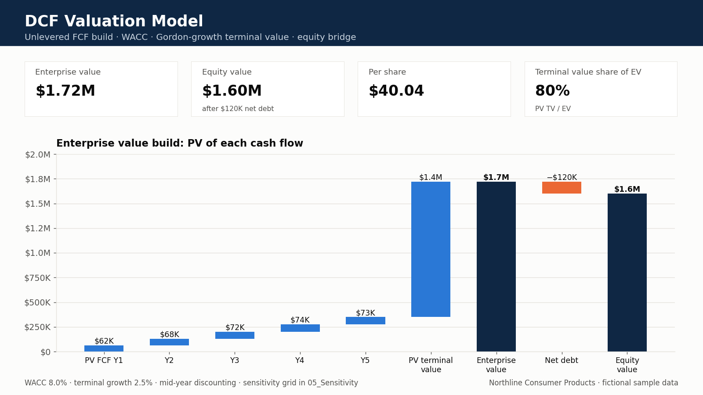

# DCF valuation model

Unlevered DCF for a fictional CPG company (**Northline Consumer Products**): free cash flow build, WACC, Gordon-growth terminal value, equity bridge, NPV and IRR.

**Open this file:** [`Northline_DCF_Valuation_Model.xlsx`](Northline_DCF_Valuation_Model.xlsx)

## Business question

Is this capital ask worth more than it costs — and how fragile is that answer if WACC is 100 bps higher or terminal growth is 50 bps lower?

## What you will see

- Five-year revenue → EBITDA → NOPAT → unlevered FCF
- CAPM cost of equity, after-tax cost of debt, and WACC
- Enterprise value from discounted FCFs + terminal value
- Equity value (EV − net debt) and value per share
- IRR on (−EV, FCF₁…FCF₄, FCF₅+TV)
- A WACC × terminal-growth sensitivity grid on equity value

Yellow cells with blue font are inputs. Black font is formulas.

## What to change in a screen-share

1. Open `01_Assumptions` and change growth, margin, WACC inputs, or `g`.
2. Confirm the FCF bridge on `02_FCF_Build` still reads like operations, not a plug.
3. Read EV, equity value, NPV, and IRR on `04_Valuation`.
4. Stress the case on `05_Sensitivity`.

**Fragility test:** lift WACC 1.0% and cut terminal `g` 0.5%. If equity value collapses, the pitch is too dependent on the terminal year — say that out loud before a committee does.

## Tabs

| Tab | Role |
| --- | --- |
| `00_Cover` | Purpose and how to use |
| `01_Assumptions` | Forecast drivers, WACC inputs, terminal g, net debt |
| `02_FCF_Build` | Unlevered free cash flow |
| `03_WACC` | CAPM and capital-structure blend |
| `04_Valuation` | Discounting, TV, EV, equity value, IRR |
| `05_Sensitivity` | Equity value vs WACC and g |
| `06_Data_Dictionary` | Field definitions |

Excel formulas only — no VBA, no live prices, no employer data.

[Profile](https://github.com/saisiri1207) · [Portfolio](https://saisiri1207.github.io) · [LinkedIn](https://www.linkedin.com/in/saisiri1207) · [bandarusaisiri1207@gmail.com](mailto:bandarusaisiri1207@gmail.com)
